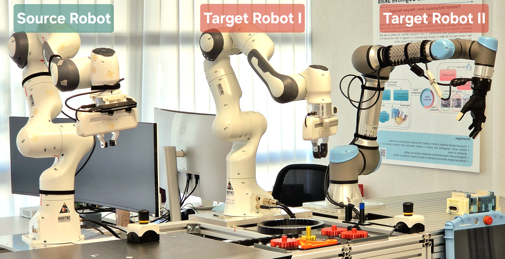
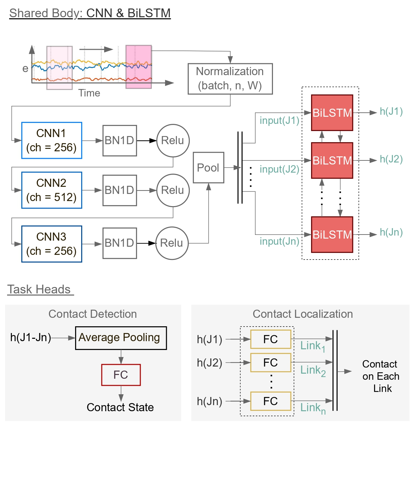
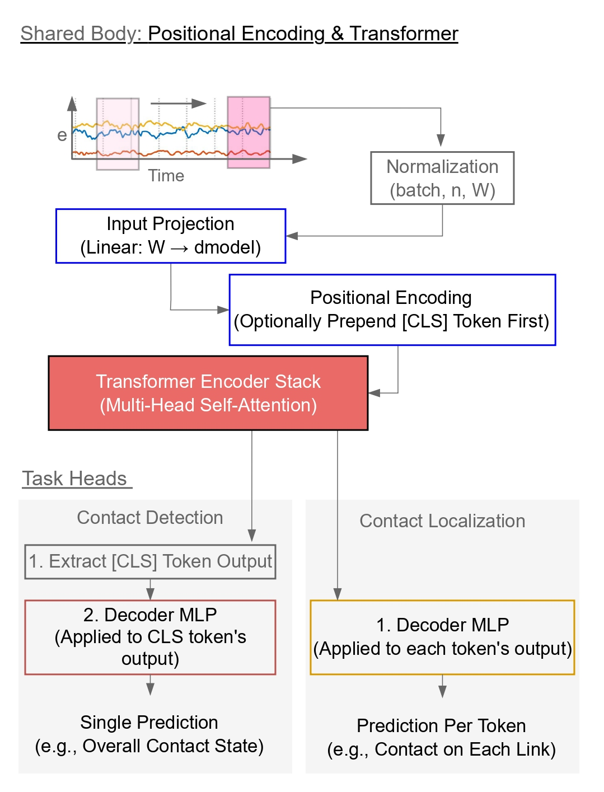

# 🦾 Contact Interpretation System (Localization)

## Overview  
This repository implements a **Contact Interpretation System** for **robotic manipulators**, focusing on *contact detection* and *contact localization* using multimodal sensory data.  
It supports **dataset management**, **model training** (CNN-BiLSTM, Transformer, and DML frameworks), and **real-time robot control** on:  
- **Franka Emika Panda** (via `frankx` API)  
- **UR5e** (via RTDE interface)

The system enables reproducible research on **cross-robot contact understanding**, providing pipelines for both **source** and **target** domain experiments.






---

## 🗂️ Repository Structure

| Directory | Description |
|-----------|-------------|
| `dataset/` | Datasets for source (Franka main) and target robots (Franka MindLab, UR5e). |
| `pipelines/` | Training and evaluation pipelines for hyperparameter tuning. |
| `pipelines_transferLearning/` | Fine-tuning, evaluation, and best-model scripts for transfer learning experiments. |
| `src/` | Robot control, API integration (Franka Panda & UR5e), real-time contact detection, and utilities. |
| `data_collection/` | Scripts for sensor data acquisition from both robots. |
| `environment.yml`, `requirements.txt` | Conda and pip environment setup files. |

---
## ⚙️ Installation

This project can run on both CPU and GPU, but the requirements differ based on your goal:

* **Training:** A CUDA-enabled **GPU is highly recommended** for training the models in a reasonable amount of time.
* **Evaluation:** The evaluation and real-time control scripts **can run on a CPU**, though a GPU will still be faster.

For more details on the hardware and performance benchmarks, please refer to the accompanying paper.

### 1. Install PyTorch

Choose **one** of the following options based on your hardware:

#### Option A: GPU (Recommended for Training)
Install PyTorch first by running the command that matches your system's CUDA version.
```bash
# Example for CUDA 12.1 (check the official PyTorch website for other versions)
pip install torch torchvision torchaudio --index-url [https://download.pytorch.org/whl/cu121](https://download.pytorch.org/whl/cu121)
```
#### Option B: CPU-Only (For Evaluation or Testing)
If you do not have a compatible GPU or only plan to run evaluation, install the CPU-only version:
```bash
pip install torch torchvision torchaudio
```
### 2. Install Project Dependencies

Once PyTorch is installed, install the remaining packages using pip:
```bash
pip install -r requirements.txt
```


### (Alternative) Full Conda Environment
You can create the entire environment using the provided YAML file. This attempts to install the GPU version of PyTorch.


Note: If you are on a CPU-only machine, the Conda installation may fail or install the wrong PyTorch. We recommend using the pip method above for a more reliable setup.

#### Envirnment 1
This environment is needed to run the scripts in the pipelines/ directory and runing real-time evaluation in src.

```bash
conda env create -f environment.yml
conda activate contactInterpretation
```
#### Envirnment 2

This environment is used for scripts within pipelines_transferLearning.

```bash
conda env create -f pipelines_transferLearning/contact_env.yml
conda activate contact_env
```


## 🤖 Robot Setup

### Franka Panda (via `frankx`)
1. Power on the robot → yellow LED.  
2. Connect to console (`ROBOT_IP`).  
3. Unlock the robot → blue LED → activate FCI.  
4. Run control scripts from the control PC.

### UR5e (via RTDE)
1. Enable **remote control** via the teach pendant.  
2. Ensure RTDE communication is active before running scripts.

## 🧠 Training Pipelines

### Hyperparameter Tuning (`pipelines/`)
- **Data Preprocessing:** `pipelines/data_pipeline.py`  
- **Contact Detection:** `pipelines/src_m2/training_contact_detection.py`  
- **Localization:** `pipelines/src_2/training_contact_localization.py`  
- **Baseline Models:** `pipelines/ref25_training_testing.ipynb`

### Transfer Learning & Evaluation (`pipelines_transferLearning/scripts/`)

| Task | Example Command |
|------|------------------|
| **Baseline Training** | `python run_dml_training.py --config baselineModels/baseline_{robot}.yaml` |
| **Evaluation** | `python run_dml_training.py --config {model_group}/{config_name}.yaml` |
| **Fine-tuning** | `python run_fineTuning.py --config bestModels/{config_name}.yaml` |
| **Full Training** | `python run_training.py --config {model_group}/{config_name}.yaml` |
| **Runtime Benchmarking** | `python runtime_benchmark.py` |

## 📊 Experimental Insights

- **Temporal Context is Task-Dependent:**  
  Contact *detection* benefits from shorter windows (80–100) due to signal-change sensitivity, while *localization* prefers longer windows (150–350) to capture manipulator dynamics.

- **Model Complexity Effects:**  
  CNN-BiLSTM performance depends more on **data framing** (window and gap size) than on model depth or hidden size.

- **Cross-Robot Generalization:**  
  Transformers outperform CNN-BiLSTM in *detection* under domain shift, while CNN-BiLSTM achieves higher *localization* accuracy.  
  When trained on target data, both regain **>93%** accuracy — indicating that **domain gap**, not model capacity, limits transferability.

